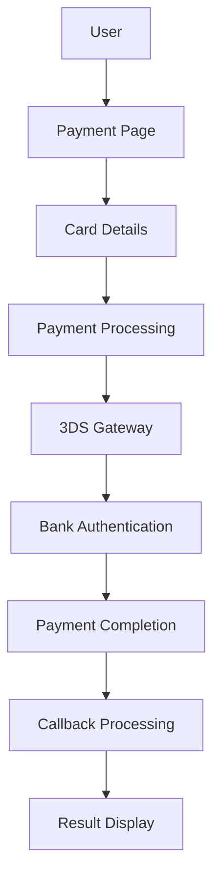

# Cardzone Routes Guide

## 📋 **Overview**

This document provides a comprehensive guide to the **Cardzone 3DS payment routes** organized in a logical flow-based structure. The routes are designed to follow the natural payment process flow and provide clear separation between different stages of the payment process.

## 🎯 **Payment Flow Architecture**

### **Flow Overview**


## 🚀 **Route Organization**

### **Payment Flow Routes (Organized by Stage)**

```php
// =============================================================================
// CARDZONE 3DS PAYMENT FLOW ROUTES
// =============================================================================

// Step 1: Payment Initiation & Processing
Route::prefix('payment/cardzone')->group(function () {
    // Payment page display
    Route::get('/page', [PaymentController::class, 'showPaymentPage'])->name('cardzone.page');
    Route::get('/pay', [PaymentController::class, 'showPaymentPage'])->name('cardzone.pay');
    Route::get('/debug', [PaymentController::class, 'showPaymentPage'])->name('cardzone.debug');
    
    // Payment processing
    Route::post('/initiate', [PaymentController::class, 'initiatePayment'])->name('cardzone.initiate');
    Route::post('/key-exchange', [PaymentController::class, 'performKeyExchange'])->name('cardzone.key-exchange');
    
    // Test connection
    Route::get('/test-connection', [PaymentController::class, 'testCardzoneConnection'])->name('cardzone.test-connection');
});

// Step 2: Payment Gateway Redirection
Route::prefix('payment/cardzone')->group(function () {
    // Redirect to 3DS gateway
    Route::get('/redirect', [PaymentController::class, 'showRedirectPage'])->name('cardzone.redirect');
});

// Step 3: Payment Callback Processing
Route::prefix('payment/cardzone')->group(function () {
    // Cardzone callback
    Route::post('/callback', [PaymentController::class, 'handleCardzoneCallback'])->name('cardzone.callback');
});

// Step 4: Payment Results & Receipts
Route::prefix('payment/cardzone')->group(function () {
    // Payment success page
    Route::get('/success', [PaymentController::class, 'paymentSuccess'])->name('cardzone.success');
    
    // Payment failure page
    Route::get('/failure', [PaymentController::class, 'paymentFailure'])->name('cardzone.failure');
});
```

## 📊 **Detailed Route Documentation**

### **Step 1: Payment Initiation & Processing**

#### **`/payment/cardzone/page`**
- **Purpose**: Display Cardzone payment page
- **Method**: GET
- **Controller**: `PaymentController@showPaymentPage`
- **Response**: Payment page view
- **Usage**: Main entry point for card payments

#### **`/payment/cardzone/pay`**
- **Purpose**: Alternative payment page entry
- **Method**: GET
- **Controller**: `PaymentController@showPaymentPage`
- **Response**: Payment page view
- **Usage**: Legacy compatibility route

#### **`/payment/cardzone/debug`**
- **Purpose**: Debug payment page
- **Method**: GET
- **Controller**: `PaymentController@showPaymentPage`
- **Response**: Debug payment page view
- **Usage**: Development and testing

#### **`/payment/cardzone/initiate`**
- **Purpose**: Initiate card payment transaction
- **Method**: POST
- **Controller**: `PaymentController@initiatePayment`
- **Response**: JSON payment initiation result
- **Usage**: Start payment process with card details

#### **`/payment/cardzone/key-exchange`**
- **Purpose**: Perform key exchange with Cardzone
- **Method**: POST
- **Controller**: `PaymentController@performKeyExchange`
- **Response**: JSON key exchange result
- **Usage**: Establish secure communication

#### **`/payment/cardzone/test-connection`**
- **Purpose**: Test Cardzone connectivity
- **Method**: GET
- **Controller**: `PaymentController@testCardzoneConnection`
- **Response**: JSON connection status
- **Usage**: Verify Cardzone service availability

### **Step 2: Payment Gateway Redirection**

#### **`/payment/cardzone/redirect`**
- **Purpose**: Redirect to 3DS gateway
- **Method**: GET
- **Controller**: `PaymentController@showRedirectPage`
- **Response**: Redirect page with 3DS form
- **Usage**: Redirect user to bank authentication

### **Step 3: Payment Callback Processing**

#### **`/payment/cardzone/callback`**
- **Purpose**: Handle Cardzone payment callback
- **Method**: POST
- **Controller**: `PaymentController@handleCardzoneCallback`
- **Response**: Success/failure response
- **Usage**: Process payment result from Cardzone

### **Step 4: Payment Results & Receipts**

#### **`/payment/cardzone/success`**
- **Purpose**: Display payment success page
- **Method**: GET
- **Controller**: `PaymentController@paymentSuccess`
- **Response**: Success page view
- **Usage**: Show payment completion

#### **`/payment/cardzone/failure`**
- **Purpose**: Display payment failure page
- **Method**: GET
- **Controller**: `PaymentController@paymentFailure`
- **Response**: Failure page view
- **Usage**: Show payment failure details

## 🔧 **API Routes**

### **Cardzone API Routes**
```php
// =============================================================================
// CARDZONE API ROUTES
// =============================================================================
Route::prefix('api/cardzone')->group(function () {
    // Bank list API
    Route::get('/banks', [PaymentController::class, 'getBankList'])->name('api.cardzone.banks.list');
    
    // Payment processing API
    Route::post('/payment/process', [PaymentController::class, 'processPayment'])->name('api.cardzone.payment.process');
    Route::post('/payment/initiate', [PaymentController::class, 'initiatePayment'])->name('api.cardzone.payment.initiate');
    Route::post('/payment/key-exchange', [PaymentController::class, 'performKeyExchange'])->name('api.cardzone.payment.key-exchange');
});
```

#### **`/api/cardzone/banks`**
- **Purpose**: Get available banks for card payments
- **Method**: GET
- **Controller**: `PaymentController@getBankList`
- **Response**: JSON bank list
- **Usage**: Frontend bank selection

#### **`/api/cardzone/payment/process`**
- **Purpose**: Process card payment via API
- **Method**: POST
- **Controller**: `PaymentController@processPayment`
- **Response**: JSON payment result
- **Usage**: API-based payment processing

#### **`/api/cardzone/payment/initiate`**
- **Purpose**: Initiate payment via API
- **Method**: POST
- **Controller**: `PaymentController@initiatePayment`
- **Response**: JSON initiation result
- **Usage**: API-based payment initiation

#### **`/api/cardzone/payment/key-exchange`**
- **Purpose**: Perform key exchange via API
- **Method**: POST
- **Controller**: `PaymentController@performKeyExchange`
- **Response**: JSON key exchange result
- **Usage**: API-based key exchange

## 🛠️ **Admin Debug Routes**

### **Cardzone Debug Dashboard**
```php
// =============================================================================
// CARDZONE DEBUG & ADMIN ROUTES
// =============================================================================

// Cardzone Debug Dashboard
Route::prefix('admin/cardzone')->group(function () {
    // Main debug dashboard
    Route::get('/debug', [CardzoneDebugController::class, 'index'])->name('admin.cardzone.debug');
    
    // Log management
    Route::get('/debug/logs', [CardzoneDebugController::class, 'logs'])->name('admin.cardzone.debug.logs');
    Route::post('/debug/clear-logs', [CardzoneDebugController::class, 'clearLogs'])->name('admin.cardzone.debug.clear-logs');
    Route::get('/debug/download', [CardzoneDebugController::class, 'downloadLogs'])->name('admin.cardzone.debug.download');
    
    // Testing functionality
    Route::post('/debug/test-payment', [CardzoneDebugController::class, 'testPayment'])->name('admin.cardzone.debug.test-payment');
    Route::post('/debug/test-key-exchange', [CardzoneDebugController::class, 'testKeyExchange'])->name('admin.cardzone.debug.test-key-exchange');
    Route::post('/debug/test-environment', [CardzoneDebugController::class, 'testEnvironment'])->name('admin.cardzone.debug.test-environment');
    Route::post('/debug/test-mac-verification', [CardzoneDebugController::class, 'testMACVerification'])->name('admin.cardzone.debug.test-mac-verification');
    
    // Transaction management
    Route::get('/debug/transactions', [CardzoneDebugController::class, 'transactions'])->name('admin.cardzone.debug.transactions');
    Route::get('/debug/transactions/{transaction}', [CardzoneDebugController::class, 'showTransaction'])->name('admin.cardzone.debug.transaction.show');
    Route::get('/debug/get-stats', [CardzoneDebugController::class, 'getStats'])->name('admin.cardzone.debug.get-stats');
});
```

#### **Debug Dashboard Routes**

##### **Main Dashboard**
- **`/admin/cardzone/debug`**: Main debug dashboard
- **`/admin/cardzone/debug/logs`**: View Cardzone logs
- **`/admin/cardzone/debug/clear-logs`**: Clear log files
- **`/admin/cardzone/debug/download`**: Download logs

##### **Testing Routes**
- **`/admin/cardzone/debug/test-payment`**: Test payment functionality
- **`/admin/cardzone/debug/test-key-exchange`**: Test key exchange
- **`/admin/cardzone/debug/test-environment`**: Test environment configuration
- **`/admin/cardzone/debug/test-mac-verification`**: Test MAC verification

##### **Transaction Management**
- **`/admin/cardzone/debug/transactions`**: View all transactions
- **`/admin/cardzone/debug/transactions/{transaction}`**: View specific transaction
- **`/admin/cardzone/debug/get-stats`**: Get transaction statistics

## 🧪 **Testing Routes**

### **Payment Flow Testing**
```bash
# 1. Test payment page
curl -X GET http://localhost:8080/payment/cardzone/page

# 2. Test payment initiation
curl -X POST http://localhost:8080/payment/cardzone/initiate \
  -H "Content-Type: application/json" \
  -d '{"amount": "100.00", "currency": "MYR", "card_number": "4111111111111111"}'

# 3. Test key exchange
curl -X POST http://localhost:8080/payment/cardzone/key-exchange \
  -H "Content-Type: application/json" \
  -d '{"merchant_id": "TEST123"}'

# 4. Test connection
curl -X GET http://localhost:8080/payment/cardzone/test-connection

# 5. Test callback
curl -X POST http://localhost:8080/payment/cardzone/callback \
  -H "Content-Type: application/json" \
  -d '{"transaction_id": "TXN123", "status": "success"}'
```

### **API Testing**
```bash
# 1. Test bank list API
curl -X GET http://localhost:8080/api/cardzone/banks

# 2. Test payment process API
curl -X POST http://localhost:8080/api/cardzone/payment/process \
  -H "Content-Type: application/json" \
  -d '{"amount": "100.00", "currency": "MYR"}'

# 3. Test payment initiation API
curl -X POST http://localhost:8080/api/cardzone/payment/initiate \
  -H "Content-Type: application/json" \
  -d '{"amount": "100.00", "currency": "MYR"}'
```

### **Debug Testing**
```bash
# 1. Test debug dashboard
curl -X GET http://localhost:8080/admin/cardzone/debug

# 2. Test log viewing
curl -X GET http://localhost:8080/admin/cardzone/debug/logs

# 3. Test payment functionality
curl -X POST http://localhost:8080/admin/cardzone/debug/test-payment \
  -H "Content-Type: application/json" \
  -d '{"amount": "100.00"}'

# 4. Test key exchange
curl -X POST http://localhost:8080/admin/cardzone/debug/test-key-exchange \
  -H "Content-Type: application/json" \
  -d '{"merchant_id": "TEST123"}'
```

## 📊 **Route Summary Table**

| Stage | Route | Method | Purpose | Usage |
|-------|-------|--------|---------|-------|
| **Initiation** | `/cardzone/page` | GET | Payment page | User interface |
| **Initiation** | `/cardzone/pay` | GET | Payment page | Legacy entry |
| **Initiation** | `/cardzone/debug` | GET | Debug page | Development |
| **Initiation** | `/cardzone/initiate` | POST | Start payment | Payment processing |
| **Initiation** | `/cardzone/key-exchange` | POST | Key exchange | Security setup |
| **Initiation** | `/cardzone/test-connection` | GET | Test connection | Health check |
| **Redirection** | `/cardzone/redirect` | GET | 3DS redirect | Gateway redirect |
| **Callback** | `/cardzone/callback` | POST | Handle callback | Payment result |
| **Results** | `/cardzone/success` | GET | Success page | Payment completion |
| **Results** | `/cardzone/failure` | GET | Failure page | Payment failure |

## ✅ **Benefits of New Route Structure**

1. **🎯 Intuitive Flow**: Routes follow payment process naturally
2. **📚 Easy to Understand**: Clear stage-based organization
3. **🔧 Developer Friendly**: Logical grouping by functionality
4. **📊 Clear Separation**: Payment vs Debug vs API routes
5. **✅ Consistent Naming**: Easy to understand route names
6. **📋 Comprehensive Documentation**: Detailed route descriptions
7. **🧪 Testing Support**: Easy testing with clear examples

## 🎯 **Summary**

The new Cardzone route structure provides:

- **✅ Logical organization** by payment flow stages
- **✅ Clear separation** between payment, API, and debug routes
- **✅ Intuitive naming** for easy developer understanding
- **✅ Comprehensive documentation** for each route
- **✅ Testing support** with clear examples
- **✅ Consistent patterns** with Paynet FPX routes

This structure makes it easy for developers to understand and implement the complete Cardzone payment flow! 🚀 