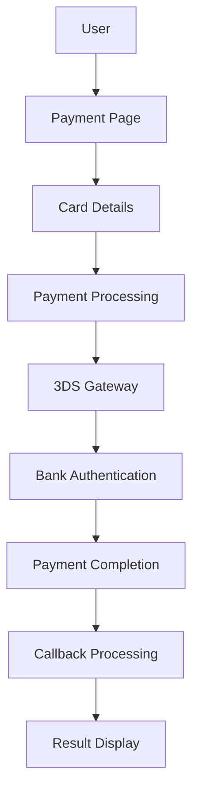

# Cardzone Routes Quick Reference

## 🚀 **Payment Flow Routes**

### **Step 1: Payment Initiation & Processing**
```php
Route::prefix('payment/cardzone')->group(function () {
    Route::get('/page', [PaymentController::class, 'showPaymentPage'])->name('cardzone.page');
    Route::get('/pay', [PaymentController::class, 'showPaymentPage'])->name('cardzone.pay');
    Route::get('/debug', [PaymentController::class, 'showPaymentPage'])->name('cardzone.debug');
    Route::post('/initiate', [PaymentController::class, 'initiatePayment'])->name('cardzone.initiate');
    Route::post('/key-exchange', [PaymentController::class, 'performKeyExchange'])->name('cardzone.key-exchange');
    Route::get('/test-connection', [PaymentController::class, 'testCardzoneConnection'])->name('cardzone.test-connection');
});
```

### **Step 2: Payment Gateway Redirection**
```php
Route::prefix('payment/cardzone')->group(function () {
    Route::get('/redirect', [PaymentController::class, 'showRedirectPage'])->name('cardzone.redirect');
});
```

### **Step 3: Payment Callback Processing**
```php
Route::prefix('payment/cardzone')->group(function () {
    Route::post('/callback', [PaymentController::class, 'handleCardzoneCallback'])->name('cardzone.callback');
});
```

### **Step 4: Payment Results & Receipts**
```php
Route::prefix('payment/cardzone')->group(function () {
    Route::get('/success', [PaymentController::class, 'paymentSuccess'])->name('cardzone.success');
    Route::get('/failure', [PaymentController::class, 'paymentFailure'])->name('cardzone.failure');
});
```

## 🔧 **API Routes**

```php
Route::prefix('api/cardzone')->group(function () {
    Route::get('/banks', [PaymentController::class, 'getBankList'])->name('api.cardzone.banks.list');
    Route::post('/payment/process', [PaymentController::class, 'processPayment'])->name('api.cardzone.payment.process');
    Route::post('/payment/initiate', [PaymentController::class, 'initiatePayment'])->name('api.cardzone.payment.initiate');
    Route::post('/payment/key-exchange', [PaymentController::class, 'performKeyExchange'])->name('api.cardzone.payment.key-exchange');
});
```

## 🛠️ **Admin Debug Routes**

```php
Route::prefix('admin/cardzone')->group(function () {
    // Main dashboard
    Route::get('/debug', [CardzoneDebugController::class, 'index'])->name('admin.cardzone.debug');
    
    // Log management
    Route::get('/debug/logs', [CardzoneDebugController::class, 'logs'])->name('admin.cardzone.debug.logs');
    Route::post('/debug/clear-logs', [CardzoneDebugController::class, 'clearLogs'])->name('admin.cardzone.debug.clear-logs');
    Route::get('/debug/download', [CardzoneDebugController::class, 'downloadLogs'])->name('admin.cardzone.debug.download');
    
    // Testing functionality
    Route::post('/debug/test-payment', [CardzoneDebugController::class, 'testPayment'])->name('admin.cardzone.debug.test-payment');
    Route::post('/debug/test-key-exchange', [CardzoneDebugController::class, 'testKeyExchange'])->name('admin.cardzone.debug.test-key-exchange');
    Route::post('/debug/test-environment', [CardzoneDebugController::class, 'testEnvironment'])->name('admin.cardzone.debug.test-environment');
    Route::post('/debug/test-mac-verification', [CardzoneDebugController::class, 'testMACVerification'])->name('admin.cardzone.debug.test-mac-verification');
    
    // Transaction management
    Route::get('/debug/transactions', [CardzoneDebugController::class, 'transactions'])->name('admin.cardzone.debug.transactions');
    Route::get('/debug/transactions/{transaction}', [CardzoneDebugController::class, 'showTransaction'])->name('admin.cardzone.debug.transaction.show');
    Route::get('/debug/get-stats', [CardzoneDebugController::class, 'getStats'])->name('admin.cardzone.debug.get-stats');
});
```

## 📊 **Route Summary**

| Stage | Route | Method | Purpose |
|-------|-------|--------|---------|
| **Initiation** | `/cardzone/page` | GET | Payment page |
| **Initiation** | `/cardzone/pay` | GET | Legacy entry |
| **Initiation** | `/cardzone/debug` | GET | Debug page |
| **Initiation** | `/cardzone/initiate` | POST | Start payment |
| **Initiation** | `/cardzone/key-exchange` | POST | Key exchange |
| **Initiation** | `/cardzone/test-connection` | GET | Health check |
| **Redirection** | `/cardzone/redirect` | GET | 3DS redirect |
| **Callback** | `/cardzone/callback` | POST | Payment result |
| **Results** | `/cardzone/success` | GET | Success page |
| **Results** | `/cardzone/failure` | GET | Failure page |

## 🧪 **Quick Testing Commands**

### **Payment Flow**
```bash
# Test payment page
curl -X GET http://localhost:8080/payment/cardzone/page

# Test payment initiation
curl -X POST http://localhost:8080/payment/cardzone/initiate \
  -H "Content-Type: application/json" \
  -d '{"amount": "100.00", "currency": "MYR"}'

# Test connection
curl -X GET http://localhost:8080/payment/cardzone/test-connection
```

### **API Testing**
```bash
# Test bank list
curl -X GET http://localhost:8080/api/cardzone/banks

# Test payment process
curl -X POST http://localhost:8080/api/cardzone/payment/process \
  -H "Content-Type: application/json" \
  -d '{"amount": "100.00", "currency": "MYR"}'
```

### **Debug Testing**
```bash
# Test debug dashboard
curl -X GET http://localhost:8080/admin/cardzone/debug

# Test payment functionality
curl -X POST http://localhost:8080/admin/cardzone/debug/test-payment \
  -H "Content-Type: application/json" \
  -d '{"amount": "100.00"}'
```

## 🎯 **Payment Flow Diagram**



## ✅ **Key Benefits**

- ✅ **Logical organization** by payment flow stages
- ✅ **Clear separation** between payment, API, and debug routes
- ✅ **Intuitive naming** for easy developer understanding
- ✅ **Consistent patterns** with Paynet FPX routes
- ✅ **Comprehensive testing** support
- ✅ **Easy maintenance** and debugging 