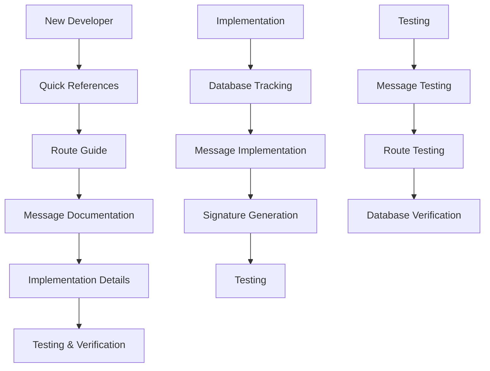

# FPX Documentation Index

## 📋 **Overview**

This index provides links to all FPX-related documentation in the project. Each document serves a specific purpose and provides comprehensive information for developers working with the Paynet FPX payment system.

## 📚 **Documentation Categories**

### **🔧 Implementation Documentation**

| Document | Purpose | Audience | Last Updated |
|----------|---------|----------|--------------|
| [`fpx-message-database-tracking.md`](./fpx-message-database-tracking.md) | Database tracking implementation | Developers | Current |
| [`fpx-messages-complete-documentation.md`](./fpx-messages-complete-documentation.md) | Complete message specifications | Developers | Current |
| [`ae-message-implementation.md`](./ae-message-implementation.md) | AE message implementation details | Developers | Current |

### **🚀 Route Documentation**

| Document | Purpose | Audience | Last Updated |
|----------|---------|----------|--------------|
| [`paynet-fpx-routes-guide.md`](./paynet-fpx-routes-guide.md) | Complete route guide | Developers | Current |
| [`fpx-routes-quick-reference.md`](./fpx-routes-quick-reference.md) | Quick route reference | Developers | Current |

### **📊 Message Documentation**

| Document | Purpose | Audience | Last Updated |
|----------|---------|----------|--------------|
| [`fpx-messages-quick-reference.md`](./fpx-messages-quick-reference.md) | Quick message reference | Developers | Current |

### **🔍 Integration Documentation**

| Document | Purpose | Audience | Last Updated |
|----------|---------|----------|--------------|
| [`paynet-fpx-integration.md`](./paynet-fpx-integration.md) | FPX integration guide | Developers | Previous |
| [`paynet-fpx-signature-implementation.md`](./paynet-fpx-signature-implementation.md) | Signature implementation | Developers | Previous |

## 🎯 **Quick Navigation by Topic**

### **📤 Message Types**
- **AR (Authorization Request)**: [`fpx-messages-complete-documentation.md#ar-authorization-request-message`](./fpx-messages-complete-documentation.md#ar-authorization-request-message)
- **AC (Acknowledgement)**: [`fpx-messages-complete-documentation.md#ac-acknowledgement-message`](./fpx-messages-complete-documentation.md#ac-acknowledgement-message)
- **BE (Bank Enquiry)**: [`fpx-messages-complete-documentation.md#be-bank-enquiry-message`](./fpx-messages-complete-documentation.md#be-bank-enquiry-message)
- **AE (Acknowledgement Enquiry)**: [`fpx-messages-complete-documentation.md#ae-acknowledgement-enquiry-message`](./fpx-messages-complete-documentation.md#ae-acknowledgement-enquiry-message)

### **🔧 Implementation**
- **Database Tracking**: [`fpx-message-database-tracking.md`](./fpx-message-database-tracking.md)
- **Signature Generation**: [`paynet-fpx-signature-implementation.md`](./paynet-fpx-signature-implementation.md)
- **AE Implementation**: [`ae-message-implementation.md`](./ae-message-implementation.md)

### **🚀 Routes**
- **Complete Guide**: [`paynet-fpx-routes-guide.md`](./paynet-fpx-routes-guide.md)
- **Quick Reference**: [`fpx-routes-quick-reference.md`](./fpx-routes-quick-reference.md)

### **🧪 Testing**
- **Message Testing**: [`fpx-messages-complete-documentation.md#testing-commands`](./fpx-messages-complete-documentation.md#testing-commands)
- **Route Testing**: [`paynet-fpx-routes-guide.md#testing-routes`](./paynet-fpx-routes-guide.md#testing-routes)

## 📊 **Documentation Summary**

### **✅ Complete Coverage**

| Aspect | Documentation | Status |
|--------|---------------|--------|
| **Message Types** | All 4 types (AR, AC, BE, AE) | ✅ Complete |
| **Payload Structures** | Complete parameter lists | ✅ Complete |
| **Signature Generation** | RSA-SHA1 implementation | ✅ Complete |
| **Database Tracking** | All message types tracked | ✅ Complete |
| **Route Organization** | Flow-based structure | ✅ Complete |
| **Testing Commands** | All message types | ✅ Complete |
| **Security Considerations** | Signature verification | ✅ Complete |

### **📋 Quick Reference Links**

#### **For New Developers**
1. Start with: [`fpx-routes-quick-reference.md`](./fpx-routes-quick-reference.md)
2. Then read: [`fpx-messages-quick-reference.md`](./fpx-messages-quick-reference.md)
3. For details: [`fpx-messages-complete-documentation.md`](./fpx-messages-complete-documentation.md)

#### **For Implementation**
1. Database tracking: [`fpx-message-database-tracking.md`](./fpx-message-database-tracking.md)
2. Route structure: [`paynet-fpx-routes-guide.md`](./paynet-fpx-routes-guide.md)
3. Message details: [`fpx-messages-complete-documentation.md`](./fpx-messages-complete-documentation.md)

#### **For Testing**
1. Message testing: [`fpx-messages-complete-documentation.md#testing-commands`](./fpx-messages-complete-documentation.md#testing-commands)
2. Route testing: [`paynet-fpx-routes-guide.md#testing-routes`](./paynet-fpx-routes-guide.md#testing-routes)

## 🔄 **Documentation Flow**

## 📚 **Documentation Standards**

### **Consistent Format**
- ✅ Clear section headers
- ✅ Code examples with syntax highlighting
- ✅ Tables for comparison
- ✅ Mermaid diagrams for flows
- ✅ Testing commands included
- ✅ Database tracking details

### **Comprehensive Coverage**
- ✅ All 4 FPX message types
- ✅ Complete payload structures
- ✅ Signature generation algorithms
- ✅ Database tracking implementation
- ✅ Route organization
- ✅ Testing procedures
- ✅ Security considerations

## 🎯 **Key Benefits**

1. **📚 Comprehensive Coverage**: All aspects of FPX implementation documented
2. **🔧 Practical Examples**: Real code examples and testing commands
3. **📊 Visual Aids**: Tables, diagrams, and flow charts
4. **🧪 Testing Support**: Complete testing procedures for all components
5. **🔐 Security Focus**: Signature verification and security considerations
6. **📋 Quick Reference**: Easy-to-find information for common tasks

## ✅ **Documentation Status**

| Category | Status | Coverage |
|----------|--------|----------|
| **Message Types** | ✅ Complete | 4/4 types documented |
| **Payload Structures** | ✅ Complete | All parameters documented |
| **Signature Generation** | ✅ Complete | RSA-SHA1 implementation |
| **Database Tracking** | ✅ Complete | All message types tracked |
| **Route Organization** | ✅ Complete | Flow-based structure |
| **Testing Procedures** | ✅ Complete | All components testable |
| **Security Considerations** | ✅ Complete | Signature verification |

## 🚀 **Getting Started**

1. **For Quick Start**: Read [`fpx-routes-quick-reference.md`](./fpx-routes-quick-reference.md)
2. **For Message Details**: Read [`fpx-messages-quick-reference.md`](./fpx-messages-quick-reference.md)
3. **For Complete Understanding**: Read [`fpx-messages-complete-documentation.md`](./fpx-messages-complete-documentation.md)
4. **For Implementation**: Read [`fpx-message-database-tracking.md`](./fpx-message-database-tracking.md)

This documentation index provides **comprehensive coverage** of all FPX-related aspects in the project! 🎉 