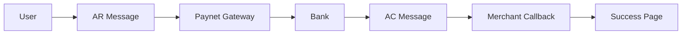
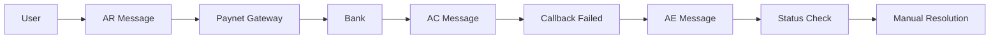
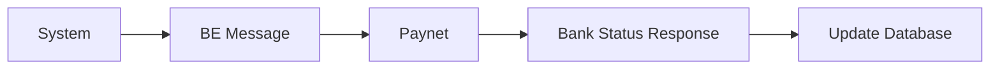

# FPX Messages Complete Documentation

## 📋 **Overview**

This document provides comprehensive documentation for **all 4 FPX message types** (AR, AC, BE, AE) used in the Paynet FPX payment system. Each message type has specific purposes, payload structures, and signature requirements.

## 🎯 **FPX Message Types Summary**

| Message Type | Purpose | Direction | When Used | Database Tracking |
|--------------|---------|-----------|-----------|-------------------|
| **AR** | Authorization Request | Merchant → Paynet | Payment initiation | ✅ `fpx_ar_message_data` |
| **AC** | Acknowledgement | Paynet → Merchant | Payment callback | ✅ `fpx_ac_message_data` |
| **BE** | Bank Enquiry | Merchant → Paynet | Bank status updates | ✅ `fpx_be_message_data` |
| **AE** | Acknowledgement Enquiry | Merchant → Paynet | Manual status check | ✅ `fpx_ae_message_data` |

## 🔧 **Message Implementation Details**

---

## 📤 **AR (Authorization Request) Message**

### **Purpose**
- **Primary**: Initiate payment transaction
- **Flow**: Merchant → Paynet → Bank
- **Result**: Redirect user to FPX gateway for payment

### **When Sent**
- User clicks "Proceed to Payment" on FPX form
- Payment data is validated and processed
- AR message is created and sent to Paynet

### **Payload Structure (25 Parameters)**

```php
$arPayload = [
    // Message Information
    'msgToken' => '01',                    // Message token (always '01')
    'msgType' => 'AR',                     // Message type (Authorization Request)
    'version' => '7.0',                    // FPX version
    
    // Seller Information
    'sellerExId' => 'EX00010946',          // Seller external ID
    'sellerExOrderNo' => 'JF123',          // Seller external order number
    'sellerTxnTime' => '20250115103000',   // Seller transaction time (YmdHis)
    'sellerOrderNo' => 'TXN123456789',     // Seller order number
    'sellerId' => 'EX00010946',            // Seller ID
    'sellerBankCode' => '01',              // Seller bank code
    'sellerFPXBank' => '01',               // Seller FPX bank
    'sellerOrdNo' => 'TXN123456789',       // Seller order number
    'sellerID' => 'EX00010946',            // Seller ID
    'OrdNo' => 'TXN123456789',             // Order number
    'sellerTxnTime' => '20250115103000',   // Seller transaction time
    
    // Transaction Information
    'txnCurrency' => 'MYR',                // Transaction currency
    'txnAmount' => '100.00',               // Transaction amount
    'productDesc' => 'Donation Campaign',   // Product description
    
    // Buyer Information
    'buyerEmail' => 'john@example.com',    // Buyer email
    'buyerBank' => 'MB2U0227',             // Buyer bank code
    'buyerName' => 'John Doe',             // Buyer name
    'buyerID' => 'john@example.com',       // Buyer ID
    'buyerBankBranch' => '',               // Buyer bank branch
    'buyerIBAN' => '',                     // Buyer IBAN
    'buyerAccNo' => '',                    // Buyer account number
    'makerName' => 'John Doe',             // Maker name
    
    // Signature
    'checkSum' => 'generated_signature'    // RSA-SHA1 signature
];
```

### **Signature Generation (AR Message)**

```php
// Checksum string order (specific to AR message)
$checksumString = ($arPayload['buyerAccNo'] ?? '') . '|' .
                  ($arPayload['buyerBankBranch'] ?? '') . '|' .
                  ($arPayload['buyerBank'] ?? '') . '|' .
                  ($arPayload['buyerEmail'] ?? '') . '|' .
                  ($arPayload['buyerIBAN'] ?? '') . '|' .
                  ($arPayload['buyerID'] ?? '') . '|' .
                  ($arPayload['buyerName'] ?? '') . '|' .
                  ($arPayload['makerName'] ?? '') . '|' .
                  ($arPayload['msgToken'] ?? '') . '|' .
                  ($arPayload['msgType'] ?? '') . '|' .
                  ($arPayload['productDesc'] ?? '') . '|' .
                  ($arPayload['sellerFPXBank'] ?? '') . '|' .
                  ($arPayload['sellerID'] ?? '') . '|' .
                  ($arPayload['OrdNo'] ?? '') . '|' .
                  ($arPayload['sellerID'] ?? '') . '|' .
                  ($arPayload['sellerOrdNo'] ?? '') . '|' .
                  ($arPayload['sellerTxnTime'] ?? '') . '|' .
                  ($arPayload['txnAmount'] ?? '') . '|' .
                  ($arPayload['txnCurrency'] ?? '') . '|' .
                  ($arPayload['version'] ?? '');

// Generate RSA-SHA1 signature
$signature = openssl_sign($checksumString, $signatureData, $privateKey, OPENSSL_ALGO_SHA1);
$arPayload['checkSum'] = base64_encode($signatureData);
```

### **Database Tracking**

```php
// Save AR message data to database
$transaction->update([
    'fpx_ar_message_data' => $arPayload,
    'fpx_ar_sent_at' => now(),
    'fpx_ar_status' => 'sent',
    'fpx_last_message_type' => 'AR',
    'fpx_last_message_at' => now(),
    'fpx_message_sequence' => 'AR',
]);
```

### **Route**
```bash
POST /payment/fpx/process
```

---

## 📥 **AC (Acknowledgement) Message**

### **Purpose**
- **Primary**: Receive payment confirmation from bank
- **Flow**: Paynet → Merchant (Callback)
- **Result**: Update transaction status and show result

### **When Received**
- User completes payment at bank
- Bank sends confirmation to Paynet
- Paynet forwards AC message to merchant callback URL

### **Payload Structure (Callback Data)**

```php
$acPayload = [
    // Message Information
    'fpx_msgType' => 'AC',                 // Message type (Acknowledgement)
    'fpx_msgToken' => '01',                // Message token
    
    // Transaction Information
    'fpx_sellerExOrderNo' => 'TXN123456789', // Seller external order number
    'fpx_txnStatus' => 'success',          // Transaction status
    'fpx_txnAmount' => '100.00',           // Transaction amount
    'fpx_txnCurrency' => 'MYR',            // Transaction currency
    
    // Bank Response
    'fpx_debitAuthCode' => '00',           // Debit authorization code
    'fpx_fpxTxnId' => 'FPX987654321',      // FPX transaction ID
    'fpx_buyerBankId' => 'MB2U0227',       // Buyer bank ID
    'fpx_buyerName' => 'John Doe',         // Buyer name
    'fpx_buyerEmail' => 'john@example.com', // Buyer email
    
    // Additional Information
    'fpx_checkSum' => 'callback_signature', // Callback signature
    'fpx_version' => '7.0',                // FPX version
    'fpx_sellerId' => 'EX00010946',        // Seller ID
    'fpx_sellerTxnTime' => '20250115103000', // Seller transaction time
    'fpx_productDesc' => 'Donation Campaign', // Product description
];
```

### **Response Code Mapping**

| Code | Status | Description |
|------|--------|-------------|
| `00` | Success | Payment successful |
| `FE` | Failed | Internal error |
| `FF` | Failed | Transaction failed |
| `FA` | Failed | Authentication failed |
| `FB` | Failed | Bank error |
| `FC` | Failed | Cancelled by user |

### **Database Tracking**

```php
// Save AC message data to database
$transaction->update([
    'fpx_ac_message_data' => $acPayload,
    'fpx_ac_received_at' => now(),
    'fpx_ac_status' => $isValid ? 'processed' : 'failed',
    'fpx_ac_response_code' => $responseCode,
    'fpx_last_message_type' => 'AC',
    'fpx_last_message_at' => now(),
    'fpx_message_sequence' => $transaction->fpx_message_sequence ? $transaction->fpx_message_sequence . '->AC' : 'AR->AC',
]);
```

### **Route**
```bash
POST /payment/fpx/callback
```

---

## 🔍 **BE (Bank Enquiry) Message**

### **Purpose**
- **Primary**: Query bank status and availability
- **Flow**: Merchant → Paynet
- **Result**: Update bank status in database

### **When Sent**
- System scheduled bank status updates
- Manual bank status refresh
- Bank list initialization

### **Payload Structure (4 Parameters)**

```php
$bePayload = [
    // Message Information
    'msgToken' => '01',                    // Message token
    'msgType' => 'BE',                     // Message type (Bank Enquiry)
    'sellerExId' => 'EX00010946',          // Seller external ID
    'version' => '7.0',                    // FPX version
];
```

### **Response Format**

```php
// Bank list response format
$bankListResponse = 'fpx_bankList=MB2U0227%7EA%2CCIMB0229%7EB%2CRHB0218%7EA';

// Parsed bank data
$banks = [
    [
        'code' => 'MB2U0227',
        'name' => 'Maybank',
        'status' => 'A'  // A=Active, B=Inactive
    ],
    [
        'code' => 'CIMB0229',
        'name' => 'CIMB Bank',
        'status' => 'B'
    ],
    [
        'code' => 'RHB0218',
        'name' => 'RHB Bank',
        'status' => 'A'
    ]
];
```

### **Database Tracking**

```php
// Create system transaction for BE message
$systemTransaction = \App\Models\Transaction::create([
    'transaction_id' => 'BE_' . now()->format('YmdHis') . '_' . rand(1000, 9999),
    'merchant_id' => $this->merchantId,
    'amount' => 0.00, // BE message has no amount
    'currency' => 'MYR',
    'payment_method' => 'fpx_system',
    'status' => 'completed',
    'fpx_be_message_data' => $bePayload,
    'fpx_be_sent_at' => now(),
    'fpx_be_status' => 'success',
    'fpx_last_message_type' => 'BE',
    'fpx_last_message_at' => now(),
    'fpx_message_sequence' => 'BE',
]);
```

### **Route**
```bash
POST /payment/fpx/banks/update-status
```

---

## 🔍 **AE (Acknowledgement Enquiry) Message**

### **Purpose**
- **Primary**: Manually query transaction status
- **Flow**: Merchant → Paynet
- **Result**: Get current transaction status

### **When Sent**
- Manual transaction status check
- Failed callback scenarios
- Reconciliation processes

### **Payload Structure (25 Parameters)**

```php
$aePayload = [
    // Message Information
    'fpx_msgType' => 'AE',                 // Message type (Acknowledgement Enquiry)
    'fpx_msgToken' => '01',                // Message token
    'fpx_version' => '7.0',                // FPX version
    
    // Seller Information
    'fpx_sellerExId' => 'EX00010946',      // Seller external ID
    'fpx_sellerExOrderNo' => 'JF123',      // Seller external order number
    'fpx_sellerTxnTime' => '20250115103000', // Seller transaction time
    'fpx_sellerOrderNo' => 'TXN123456789', // Seller order number
    'fpx_sellerId' => 'EX00010946',        // Seller ID
    'fpx_sellerBankCode' => '01',          // Seller bank code
    'fpx_sellerFPXBank' => '01',           // Seller FPX bank
    'fpx_sellerOrdNo' => 'TXN123456789',   // Seller order number
    'fpx_sellerID' => 'EX00010946',        // Seller ID
    'fpx_OrdNo' => 'TXN123456789',         // Order number
    'fpx_sellerTxnTime' => '20250115103000', // Seller transaction time
    
    // Transaction Information
    'fpx_txnCurrency' => 'MYR',            // Transaction currency
    'fpx_txnAmount' => '100.00',           // Transaction amount
    'fpx_productDesc' => 'Donation Campaign', // Product description
    
    // Buyer Information
    'fpx_buyerEmail' => 'john@example.com', // Buyer email
    'fpx_buyerBankId' => 'MB2U0227',       // Buyer bank ID
    'fpx_buyerName' => 'John Doe',         // Buyer name
    'fpx_buyerID' => 'john@example.com',   // Buyer ID
    'fpx_buyerBankBranch' => '',           // Buyer bank branch
    'fpx_buyerIBAN' => '',                 // Buyer IBAN
    'fpx_buyerAccNo' => '',                // Buyer account number
    'fpx_makerName' => 'John Doe',         // Maker name
    
    // Signature
    'fpx_checkSum' => 'generated_signature' // RSA-SHA1 signature
];
```

### **Signature Generation (AE Message)**

```php
// Checksum string order (same as AR message)
$checksumString = ($aePayload['fpx_buyerAccNo'] ?? '') . '|' .
                  ($aePayload['fpx_buyerBankBranch'] ?? '') . '|' .
                  ($aePayload['fpx_buyerBankId'] ?? '') . '|' .
                  ($aePayload['fpx_buyerEmail'] ?? '') . '|' .
                  ($aePayload['fpx_buyerIBAN'] ?? '') . '|' .
                  ($aePayload['fpx_buyerID'] ?? '') . '|' .
                  ($aePayload['fpx_buyerName'] ?? '') . '|' .
                  ($aePayload['fpx_makerName'] ?? '') . '|' .
                  ($aePayload['fpx_msgToken'] ?? '') . '|' .
                  ($aePayload['fpx_msgType'] ?? '') . '|' .
                  ($aePayload['fpx_productDesc'] ?? '') . '|' .
                  ($aePayload['fpx_sellerFPXBank'] ?? '') . '|' .
                  ($aePayload['fpx_sellerID'] ?? '') . '|' .
                  ($aePayload['fpx_OrdNo'] ?? '') . '|' .
                  ($aePayload['fpx_sellerID'] ?? '') . '|' .
                  ($aePayload['fpx_sellerOrdNo'] ?? '') . '|' .
                  ($aePayload['fpx_sellerTxnTime'] ?? '') . '|' .
                  ($aePayload['fpx_txnAmount'] ?? '') . '|' .
                  ($aePayload['fpx_txnCurrency'] ?? '') . '|' .
                  ($aePayload['fpx_version'] ?? '');

// Generate RSA-SHA1 signature
$signature = openssl_sign($checksumString, $signatureData, $privateKey, OPENSSL_ALGO_SHA1);
$aePayload['fpx_checkSum'] = base64_encode($signatureData);
```

### **Response Parsing**

```php
// Parse AE response
$aeResponse = 'fpx_debitAuthCode=00&fpx_fpxTxnId=FPX987654321&fpx_sellerExOrderNo=TXN123456789';

// Parse response format: key=value&key=value
$data = [];
parse_str($aeResponse, $data);

$result = [
    'success' => false,
    'transaction_id' => $transactionId,
    'response_code' => $data['fpx_debitAuthCode'] ?? '',
    'fpx_transaction_id' => $data['fpx_fpxTxnId'] ?? '',
    'response_description' => $this->getResponseCodeDescription($data['fpx_debitAuthCode'] ?? ''),
    'raw_response' => $data
];

// Determine success based on response code
if (isset($data['fpx_debitAuthCode']) && $data['fpx_debitAuthCode'] === '00') {
    $result['success'] = true;
}
```

### **Database Tracking**

```php
// Update transaction with AE message data
$transaction->update([
    'fpx_ae_message_data' => $aePayload,
    'fpx_ae_sent_at' => now(),
    'fpx_ae_status' => $aeResult ? 'success' : 'failed',
    'fpx_ae_response_code' => $aeResult['response_code'] ?? '',
    'fpx_last_message_type' => 'AE',
    'fpx_last_message_at' => now(),
    'fpx_message_sequence' => $transaction->fpx_message_sequence ? $transaction->fpx_message_sequence . '->AE' : 'AR->AC->AE',
]);
```

### **Route**
```bash
POST /payment/fpx/enquiry
```

---

## 🔄 **Message Flow Examples**

### **Standard Payment Flow**



**Message Sequence**: `AR → AC`

### **Payment with Manual Enquiry**



**Message Sequence**: `AR → AC → AE`

### **Bank Status Update**



**Message Sequence**: `BE` (independent)

---

## 📊 **Message Comparison Table**

| Aspect | AR | AC | BE | AE |
|--------|----|----|----|----|
| **Direction** | Merchant → Paynet | Paynet → Merchant | Merchant → Paynet | Merchant → Paynet |
| **Purpose** | Payment initiation | Payment confirmation | Bank status check | Manual status enquiry |
| **Parameters** | 25 | Variable | 4 | 25 |
| **Signature** | Required | Not required | Not required | Required |
| **Response** | Redirect URL | Callback data | Bank list | Status data |
| **Database** | `fpx_ar_message_data` | `fpx_ac_message_data` | `fpx_be_message_data` | `fpx_ae_message_data` |
| **Status Field** | `fpx_ar_status` | `fpx_ac_status` | `fpx_be_status` | `fpx_ae_status` |
| **Timestamp** | `fpx_ar_sent_at` | `fpx_ac_received_at` | `fpx_be_sent_at` | `fpx_ae_sent_at` |

---

## 🧪 **Testing Commands**

### **Test AR Message**
```bash
# Test payment processing (AR message)
curl -X POST http://localhost:8080/payment/fpx/process \
  -H "Content-Type: application/json" \
  -d '{
    "donation_id": "123",
    "amount": "100.00",
    "fpx_bank": "MB2U0227",
    "fpx_buyer_name": "John Doe",
    "fpx_buyer_email": "john@example.com"
  }'
```

### **Test AC Message (Simulate Callback)**
```bash
# Simulate AC callback
curl -X POST http://localhost:8080/payment/fpx/callback \
  -H "Content-Type: application/x-www-form-urlencoded" \
  -d 'fpx_msgType=AC&fpx_debitAuthCode=00&fpx_fpxTxnId=FPX987654321&fpx_sellerExOrderNo=TXN123456789'
```

### **Test BE Message**
```bash
# Test bank status update (BE message)
curl -X POST http://localhost:8080/payment/fpx/banks/update-status
```

### **Test AE Message**
```bash
# Test manual enquiry (AE message)
curl -X POST http://localhost:8080/payment/fpx/enquiry \
  -H "Content-Type: application/json" \
  -d '{"transaction_id": "TXN123456789"}'
```

### **Test Message History**
```bash
# View complete message history
curl -X GET http://localhost:8080/payment/fpx/history/TXN123456789
```

---

## 📋 **Command Line Testing**

### **Test AE Message with Artisan**
```bash
# Test with specific transaction ID
php artisan test:ae-message TXN123456789

# Test with latest transaction
php artisan test:ae-message
```

### **Database Verification**
```bash
# Check message data in database
php artisan tinker

>>> $transaction = App\Models\Transaction::where('transaction_id', 'TXN123456789')->first();
>>> $transaction->fpx_ar_message_data; // AR message data
>>> $transaction->fpx_ac_message_data; // AC message data
>>> $transaction->fpx_ae_message_data; // AE message data
>>> $transaction->fpx_message_sequence; // Message sequence
>>> $transaction->fpx_last_message_type; // Last message type
```

---

## 🔐 **Security Considerations**

### **Signature Verification**
- **AR Message**: Requires RSA-SHA1 signature
- **AE Message**: Requires RSA-SHA1 signature
- **AC Message**: Verify callback signature
- **BE Message**: No signature required

### **Field Validation**
- All required fields must be present
- Field lengths must match specifications
- Special characters must be properly encoded
- Amount must be in correct format (e.g., "100.00")

### **Error Handling**
- Invalid signatures should be rejected
- Missing required fields should return errors
- Network timeouts should be handled gracefully
- Database errors should be logged

---

## ✅ **Implementation Status**

| Message Type | Implementation | Database Tracking | Testing | Documentation |
|--------------|---------------|-------------------|---------|---------------|
| **AR** | ✅ Complete | ✅ Complete | ✅ Complete | ✅ Complete |
| **AC** | ✅ Complete | ✅ Complete | ✅ Complete | ✅ Complete |
| **BE** | ✅ Complete | ✅ Complete | ✅ Complete | ✅ Complete |
| **AE** | ✅ Complete | ✅ Complete | ✅ Complete | ✅ Complete |

---

## 🎯 **Summary**

All **4 FPX message types** are now **fully documented** with:

- **✅ Complete payload structures** for each message type
- **✅ Signature generation** requirements and algorithms
- **✅ Database tracking** implementation details
- **✅ Testing commands** for verification
- **✅ Security considerations** and best practices
- **✅ Message flow examples** and sequences
- **✅ Comparison tables** for easy reference

This documentation provides **comprehensive coverage** of all FPX message types used in the Paynet payment system! 🚀 