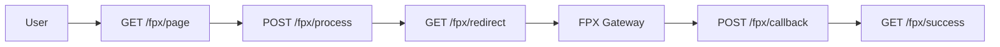

# FPX Routes Quick Reference Card

## 🚀 **Payment Flow Routes**

### **Step 1: Payment Initiation**
```bash
GET  /payment/fpx/page                    # Display payment page
POST /payment/fpx/process                 # Process payment (AR message)
GET  /payment/fpx/banks                   # Get bank list
GET  /payment/fpx/banks/active           # Get active banks
POST /payment/fpx/banks/update-status    # Update bank status (BE message)
GET  /payment/fpx/banks/status-summary   # Get status summary
```

### **Step 2: Gateway Redirection**
```bash
GET  /payment/fpx/redirect               # Redirect to FPX gateway
GET  /payment/fpx/test-connection        # Test Paynet connection
```

### **Step 3: Callback Processing**
```bash
POST /payment/fpx/callback               # Handle callback (AC message)
POST /payment/fpx/enquiry                # Manual enquiry (AE message)
GET  /payment/fpx/history/{transaction_id} # View message history
```

### **Step 4: Results & Receipts**
```bash
GET  /payment/fpx/success                # Success page
GET  /payment/fpx/failure                # Failure page
GET  /payment/fpx/receipt                # Receipt page
```

## 🔗 **API Routes**

```bash
GET  /api/fpx/banks                      # Get bank list (API)
GET  /api/fpx/banks/active              # Get active banks (API)
POST /api/fpx/banks/update-status       # Update status (API)
GET  /api/fpx/banks/status-summary      # Get summary (API)
```

## 📊 **FPX Message Mapping**

| Route | FPX Message | Purpose |
|-------|-------------|---------|
| `POST /fpx/process` | **AR** | Authorization Request |
| `POST /fpx/callback` | **AC** | Acknowledgement |
| `POST /fpx/banks/update-status` | **BE** | Bank Enquiry |
| `POST /fpx/enquiry` | **AE** | Acknowledgement Enquiry |

## 🔄 **Standard Payment Flow**



## 🧪 **Quick Testing**

```bash
# Test payment page
curl -X GET http://localhost:8080/payment/fpx/page

# Test bank list
curl -X GET http://localhost:8080/payment/fpx/banks

# Test payment processing
curl -X POST http://localhost:8080/payment/fpx/process \
  -H "Content-Type: application/json" \
  -d '{"donation_id": "123", "amount": "100.00", "fpx_bank": "MB2U0227"}'

# Test manual enquiry
curl -X POST http://localhost:8080/payment/fpx/enquiry \
  -H "Content-Type: application/json" \
  -d '{"transaction_id": "TXN123456789"}'

# Test message history
curl -X GET http://localhost:8080/payment/fpx/history/TXN123456789
```

## 📋 **Route Summary**

| Stage | Route | Method | FPX Message |
|-------|-------|--------|-------------|
| **Initiation** | `/fpx/process` | POST | AR |
| **Initiation** | `/fpx/page` | GET | - |
| **Initiation** | `/fpx/banks` | GET | - |
| **Redirection** | `/fpx/redirect` | GET | AR |
| **Callback** | `/fpx/callback` | POST | AC |
| **Callback** | `/fpx/enquiry` | POST | AE |
| **Results** | `/fpx/success` | GET | - |
| **Results** | `/fpx/failure` | GET | - |
| **Results** | `/fpx/receipt` | GET | - |

## 🎯 **Key Benefits**

- ✅ **Intuitive flow** - Routes follow payment process
- ✅ **Clear naming** - Easy to understand purpose
- ✅ **FPX mapping** - Direct correlation with FPX messages
- ✅ **Clean architecture** - Organized route structure
- ✅ **Comprehensive testing** - Easy to test each stage

## 📚 **Full Documentation**

For detailed documentation, see: `docs/paynet-fpx-routes-guide.md` 