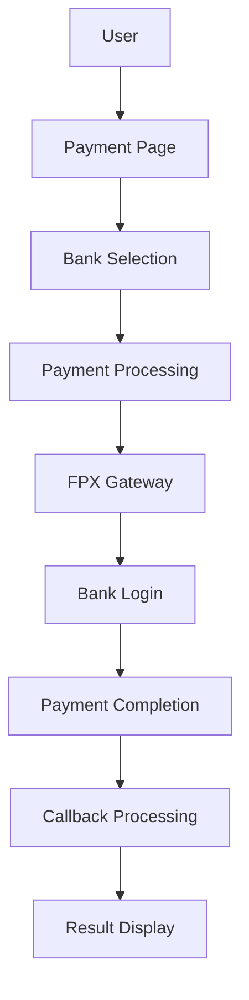

# Paynet Payment Process Flow Organization

## 📋 **Overview**

This document provides a comprehensive organization guide for the **Paynet FPX payment process flow**, covering routes, views, controllers, and their relationships.

## 🎯 **Payment Flow Architecture**

### **Flow Overview**


## 📁 **File Organization Structure**

```
app/
├── Http/Controllers/
│   └── PaymentController.php          # Main payment controller
├── Services/
│   └── PaynetService.php             # Paynet business logic
└── Models/
    ├── Transaction.php               # Transaction model
    └── Donation.php                 # Donation model

resources/views/
├── payment/fpx/
│   ├── page.blade.php               # Payment page
│   ├── redirect.blade.php           # Gateway redirect
│   ├── success.blade.php            # Success page
│   ├── failure.blade.php            # Failure page
│   └── receipt.blade.php            # Receipt page
└── components/
    ├── fpx-bank-selector.blade.php
    └── fpx-payment-form.blade.php

routes/
└── web.php                          # Route definitions
```

## 🚀 **Route Organization**

### **Payment Flow Routes (Organized by Stage)**

```php
// =============================================================================
// PAYNET FPX PAYMENT FLOW ROUTES
// =============================================================================

// Step 1: Payment Initiation & Processing
Route::prefix('payment/fpx')->group(function () {
    Route::get('/page', [PaymentController::class, 'showPaymentPage'])->name('fpx.page');
    Route::post('/process', [PaymentController::class, 'processFpxPayment'])->name('fpx.process');
    Route::get('/banks', [PaymentController::class, 'getFpxBankList'])->name('fpx.banks.list');
    Route::get('/banks/active', [PaymentController::class, 'getActiveFpxBanks'])->name('fpx.banks.active');
    Route::post('/banks/update-status', [PaymentController::class, 'updateFpxBankStatus'])->name('fpx.banks.update-status');
});

// Step 2: Payment Gateway Redirection
Route::prefix('payment/fpx')->group(function () {
    Route::get('/redirect', [PaymentController::class, 'showFpxRedirect'])->name('fpx.redirect');
    Route::get('/test-connection', [PaymentController::class, 'testPaynetConnection'])->name('fpx.test-connection');
});

// Step 3: Payment Callback Processing
Route::prefix('payment/fpx')->group(function () {
    Route::post('/callback', [PaymentController::class, 'handlePaynetCallback'])->name('fpx.callback');
    Route::post('/enquiry', [PaymentController::class, 'handleAcknowledgementEnquiry'])->name('fpx.enquiry');
    Route::get('/history/{transaction_id}', [PaymentController::class, 'showFpxMessageHistory'])->name('fpx.history');
});

// Step 4: Payment Results & Receipts
Route::prefix('payment/fpx')->group(function () {
    Route::get('/success', [PaymentController::class, 'paymentSuccess'])->name('fpx.success');
    Route::get('/failure', [PaymentController::class, 'paymentFailure'])->name('fpx.failure');
    Route::get('/receipt', [PaymentController::class, 'showReceipt'])->name('fpx.receipt');
});

// API Routes for Frontend
Route::prefix('api/fpx')->group(function () {
    Route::get('/banks', [PaymentController::class, 'getFpxBankList'])->name('api.fpx.banks.list');
    Route::get('/banks/active', [PaymentController::class, 'getActiveFpxBanks'])->name('api.fpx.banks.active');
    Route::post('/banks/update-status', [PaymentController::class, 'updateFpxBankStatus'])->name('api.fpx.banks.update-status');
});
```

## 🎨 **View Organization**

### **Payment Views Structure**

#### **1. Payment Page (`resources/views/payment/fpx/page.blade.php`)**
```php
@extends('layouts.master')

@section('content')
<div class="container mx-auto px-4 py-8">
    <div class="max-w-2xl mx-auto">
        <h1 class="text-3xl font-bold text-gray-900 text-center mb-8">FPX Online Banking</h1>
        
        <!-- FPX Payment Form -->
        @include('payment.components.fpx-payment-form')
        
        <!-- Bank Selector -->
        @include('payment.components.fpx-bank-selector')
    </div>
</div>
@endsection
```

#### **2. Gateway Redirect (`resources/views/payment/fpx/redirect.blade.php`)**
```php
@extends('layouts.master')

@section('content')
<div class="container mx-auto px-4 py-8">
    <div class="max-w-2xl mx-auto text-center">
        <h1 class="text-2xl font-bold text-gray-900 mb-4">Redirecting to FPX Gateway</h1>
        <p class="text-gray-600 mb-6">Please wait while we redirect you to your bank...</p>
        
        <!-- Auto-submit Form -->
        <form id="fpx-form" method="POST" action="{{ $gateway_url }}">
            @foreach($payload as $key => $value)
                <input type="hidden" name="{{ $key }}" value="{{ $value }}">
            @endforeach
        </form>
        
        <script>document.getElementById('fpx-form').submit();</script>
    </div>
</div>
@endsection
```

#### **3. Success Page (`resources/views/payment/fpx/success.blade.php`)**
```php
@extends('layouts.master')

@section('content')
<div class="container mx-auto px-4 py-8">
    <div class="max-w-2xl mx-auto text-center">
        <div class="bg-green-100 border border-green-400 text-green-700 px-4 py-3 rounded mb-6">
            <h1 class="text-2xl font-bold">Payment Successful!</h1>
            <p class="mt-2">Your payment has been processed successfully.</p>
        </div>
        
        <!-- Transaction Details -->
        <div class="bg-white shadow rounded-lg p-6">
            <h2 class="text-xl font-semibold mb-4">Transaction Details</h2>
            <div class="grid grid-cols-2 gap-4 text-left">
                <div><span class="font-medium">Transaction ID:</span> <span class="ml-2">{{ $transaction->transaction_id }}</span></div>
                <div><span class="font-medium">Amount:</span> <span class="ml-2">RM {{ number_format($transaction->amount, 2) }}</span></div>
                <div><span class="font-medium">Bank:</span> <span class="ml-2">{{ $transaction->paynet_response_data['fpx_buyerBankId'] ?? 'N/A' }}</span></div>
                <div><span class="font-medium">Status:</span> <span class="ml-2 text-green-600">Completed</span></div>
            </div>
        </div>
        
        <!-- Action Buttons -->
        <div class="mt-6 space-x-4">
            <a href="{{ route('fpx.receipt') }}" class="bg-blue-600 text-white px-6 py-2 rounded hover:bg-blue-700">View Receipt</a>
            <a href="{{ route('home') }}" class="bg-gray-600 text-white px-6 py-2 rounded hover:bg-gray-700">Return Home</a>
        </div>
    </div>
</div>
@endsection
```

#### **4. Failure Page (`resources/views/payment/fpx/failure.blade.php`)**
```php
@extends('layouts.master')

@section('content')
<div class="container mx-auto px-4 py-8">
    <div class="max-w-2xl mx-auto text-center">
        <div class="bg-red-100 border border-red-400 text-red-700 px-4 py-3 rounded mb-6">
            <h1 class="text-2xl font-bold">Payment Failed</h1>
            <p class="mt-2">{{ $error_message ?? 'Your payment could not be processed.' }}</p>
        </div>
        
        <!-- Action Buttons -->
        <div class="mt-6 space-x-4">
            <a href="{{ route('fpx.page') }}" class="bg-blue-600 text-white px-6 py-2 rounded hover:bg-blue-700">Try Again</a>
            <a href="{{ route('home') }}" class="bg-gray-600 text-white px-6 py-2 rounded hover:bg-gray-700">Return Home</a>
        </div>
    </div>
</div>
@endsection
```

#### **5. Receipt Page (`resources/views/payment/fpx/receipt.blade.php`)**
```php
@extends('layouts.master')

@section('content')
<div class="container mx-auto px-4 py-8">
    <div class="max-w-2xl mx-auto">
        <div class="bg-white shadow rounded-lg p-6">
            <h1 class="text-2xl font-bold text-center mb-6">Payment Receipt</h1>
            
            <!-- Transaction Details -->
            <div class="space-y-4">
                <div class="flex justify-between">
                    <span class="font-medium">Transaction ID:</span>
                    <span class="font-mono">{{ $transaction->transaction_id }}</span>
                </div>
                <div class="flex justify-between">
                    <span class="font-medium">Amount:</span>
                    <span class="font-semibold">RM {{ number_format($transaction->amount, 2) }}</span>
                </div>
                <div class="flex justify-between">
                    <span class="font-medium">Bank:</span>
                    <span class="font-semibold">{{ $transaction->paynet_response_data['fpx_buyerBankId'] ?? 'N/A' }}</span>
                </div>
                <div class="flex justify-between">
                    <span class="font-medium">Date:</span>
                    <span>{{ $transaction->created_at->format('d/m/Y H:i:s') }}</span>
                </div>
                <div class="flex justify-between">
                    <span class="font-medium">Status:</span>
                    <span class="text-green-600 font-semibold">Completed</span>
                </div>
            </div>
            
            <!-- Print Button -->
            <div class="mt-8 text-center">
                <button onclick="window.print()" class="bg-blue-600 text-white px-6 py-2 rounded hover:bg-blue-700">Print Receipt</button>
            </div>
        </div>
    </div>
</div>
@endsection
```

### **Component Views**

#### **1. FPX Payment Form (`resources/views/payment/components/fpx-payment-form.blade.php`)**
```php
<form id="fpx-payment-form" method="POST" action="{{ route('fpx.process') }}" class="space-y-6">
    @csrf
    
    <!-- Hidden Fields -->
    <input type="hidden" name="donation_id" value="{{ $donation->id }}">
    <input type="hidden" name="amount" value="{{ $donation->amount }}">
    <input type="hidden" name="campaign_id" value="{{ $donation->campaign_id }}">
    
    <!-- Customer Information -->
    <div class="space-y-4">
        <div>
            <label for="fpx_buyer_name" class="block text-sm font-medium text-gray-700 mb-1">Full Name *</label>
            <input type="text" name="fpx_buyer_name" id="fpx_buyer_name" required
                   value="{{ $donation->name }}" 
                   class="w-full px-3 py-2 border border-gray-300 rounded-md focus:outline-none focus:ring-2 focus:ring-blue-500">
        </div>
        
        <div>
            <label for="fpx_buyer_email" class="block text-sm font-medium text-gray-700 mb-1">Email Address *</label>
            <input type="email" name="fpx_buyer_email" id="fpx_buyer_email" required
                   value="{{ $donation->email }}"
                   class="w-full px-3 py-2 border border-gray-300 rounded-md focus:outline-none focus:ring-2 focus:ring-blue-500">
        </div>
    </div>
    
    <!-- Bank Selection -->
    <div>
        <label for="fpx_bank" class="block text-sm font-medium text-gray-700 mb-1">Bank *</label>
        <select name="fpx_bank" id="fpx_bank" required
                class="w-full px-3 py-2 border border-gray-300 rounded-md focus:outline-none focus:ring-2 focus:ring-blue-500">
            <option value="">Select your bank</option>
        </select>
    </div>
    
    <!-- Terms and Conditions -->
    <div class="flex items-center">
        <input type="checkbox" name="accept_terms" id="accept_terms" required
               class="rounded border-gray-300 text-blue-600 focus:ring-blue-500">
        <label for="accept_terms" class="ml-2 text-sm text-gray-700">
            I accept the <a href="#" class="text-blue-600 hover:underline">terms and conditions</a>
        </label>
    </div>
    
    <!-- Submit Button -->
    <button type="submit" id="submit-btn" disabled
            class="w-full bg-blue-600 text-white py-3 px-6 rounded-lg hover:bg-blue-700 disabled:opacity-50 disabled:cursor-not-allowed">
        Proceed to FPX Payment
    </button>
</form>
```

#### **2. FPX Bank Selector (`resources/views/payment/components/fpx-bank-selector.blade.php`)**
```php
<div class="mt-4">
    <h3 class="text-lg font-medium text-gray-900 mb-3">Available Banks</h3>
    
    <!-- Bank Groups -->
    <div id="bank-groups" class="space-y-4">
        <!-- Commercial Banks -->
        <div class="bank-group">
            <h4 class="font-medium text-gray-700 mb-2">Commercial Banks</h4>
            <div class="grid grid-cols-2 gap-2" id="commercial-banks">
                <!-- Banks will be loaded here -->
            </div>
        </div>
        
        <!-- Islamic Banks -->
        <div class="bank-group">
            <h4 class="font-medium text-gray-700 mb-2">Islamic Banks</h4>
            <div class="grid grid-cols-2 gap-2" id="islamic-banks">
                <!-- Banks will be loaded here -->
            </div>
        </div>
    </div>
    
    <!-- Loading State -->
    <div id="bank-loading" class="text-center py-4">
        <div class="animate-spin rounded-full h-8 w-8 border-b-2 border-blue-600 mx-auto"></div>
        <p class="text-gray-600 mt-2">Loading banks...</p>
    </div>
    
    <!-- Error State -->
    <div id="bank-error" class="hidden text-center py-4">
        <p class="text-red-600">Failed to load banks. Please refresh the page.</p>
        <button onclick="loadBanks()" class="mt-2 text-blue-600 hover:underline">Try Again</button>
    </div>
</div>

<script>
// Bank loading functionality
function loadBanks() {
    fetch('/api/fpx/banks')
        .then(response => response.json())
        .then(data => {
            if (data.success) {
                populateBanks(data.banks);
            } else {
                showBankError();
            }
        })
        .catch(error => {
            console.error('Error loading banks:', error);
            showBankError();
        });
}

function populateBanks(banks) {
    // Implementation to populate bank options
}

function showBankError() {
    document.getElementById('bank-loading').classList.add('hidden');
    document.getElementById('bank-error').classList.remove('hidden');
}

// Load banks on page load
document.addEventListener('DOMContentLoaded', loadBanks);
</script>
```

## 🎮 **Controller Organization**

### **PaymentController Structure**

```php
<?php

namespace App\Http\Controllers;

use App\Services\PaynetService;
use App\Models\Transaction;
use App\Models\Donation;
use Illuminate\Http\Request;
use Illuminate\Support\Facades\Log;

class PaymentController extends Controller
{
    protected $paynetService;
    
    public function __construct(PaynetService $paynetService)
    {
        $this->paynetService = $paynetService;
    }
    
    // =============================================================================
    // STEP 1: PAYMENT INITIATION & PROCESSING
    // =============================================================================
    
    /**
     * Display FPX payment page
     */
    public function showPaymentPage(Request $request)
    {
        if (!session()->has('donation_data')) {
            return redirect()->route('home')->with('error', 'No donation data found.');
        }
        
        $donationData = session('donation_data');
        $donation = Donation::find($donationData['donation_id']);
        
        if (!$donation) {
            return redirect()->route('home')->with('error', 'Donation not found.');
        }
        
        return view('payment.fpx.page', compact('donation'));
    }
    
    /**
     * Process FPX payment (AR message)
     */
    public function processFpxPayment(Request $request)
    {
        try {
            // Validate request
            $request->validate([
                'donation_id' => 'required|exists:donations,id',
                'amount' => 'required|numeric|min:1',
                'fpx_bank' => 'required|string',
                'fpx_buyer_name' => 'required|string|max:255',
                'fpx_buyer_email' => 'required|email',
                'accept_terms' => 'required|accepted',
            ]);
            
            // Create transaction
            $transaction = Transaction::create([
                'transaction_id' => $this->generateTransactionId(),
                'merchant_id' => config('paynet.merchant_id'),
                'amount' => $request->amount,
                'currency' => 'MYR',
                'payment_method' => 'fpx',
                'status' => 'pending',
                'donation_id' => $request->donation_id,
            ]);
            
            // Process FPX payment
            $result = $this->paynetService->createFpxPayment([
                'transaction_id' => $transaction->transaction_id,
                'amount' => $request->amount,
                'donation_id' => $request->donation_id,
                'fpx_bank' => $request->fpx_bank,
                'donor_name' => $request->fpx_buyer_name,
                'donor_email' => $request->fpx_buyer_email,
            ]);
            
            if ($result['success']) {
                session([
                    'fpx_redirect_data' => [
                        'gateway_url' => $result['gateway_url'],
                        'payload' => $result['payload'],
                        'transaction_id' => $transaction->transaction_id,
                    ]
                ]);
                
                return response()->json([
                    'success' => true,
                    'redirect_url' => route('fpx.redirect'),
                    'message' => 'Payment processed successfully'
                ]);
            } else {
                return response()->json([
                    'success' => false,
                    'message' => $result['error'] ?? 'Payment processing failed'
                ], 400);
            }
            
        } catch (\Exception $e) {
            Log::error('FPX payment processing error', [
                'error' => $e->getMessage(),
                'request_data' => $request->all()
            ]);
            
            return response()->json([
                'success' => false,
                'message' => 'Payment processing failed. Please try again.'
            ], 500);
        }
    }
    
    /**
     * Get FPX bank list
     */
    public function getFpxBankList()
    {
        try {
            $banks = $this->paynetService->getFpxBankList();
            
            return response()->json([
                'success' => true,
                'banks' => $banks
            ]);
        } catch (\Exception $e) {
            Log::error('Error getting FPX bank list', [
                'error' => $e->getMessage()
            ]);
            
            return response()->json([
                'success' => false,
                'message' => 'Failed to load banks'
            ], 500);
        }
    }
    
    // =============================================================================
    // STEP 2: PAYMENT GATEWAY REDIRECTION
    // =============================================================================
    
    /**
     * Show FPX redirect page
     */
    public function showFpxRedirect(Request $request)
    {
        $redirectData = session('fpx_redirect_data');
        
        if (!$redirectData) {
            return redirect()->route('fpx.page')->with('error', 'No redirect data found.');
        }
        
        return view('payment.fpx.redirect', [
            'gateway_url' => $redirectData['gateway_url'],
            'payload' => $redirectData['payload']
        ]);
    }
    
    /**
     * Test Paynet connection
     */
    public function testPaynetConnection()
    {
        try {
            $result = $this->paynetService->testConnection();
            
            return response()->json([
                'success' => true,
                'message' => 'Connection successful',
                'data' => $result
            ]);
        } catch (\Exception $e) {
            return response()->json([
                'success' => false,
                'message' => 'Connection failed: ' . $e->getMessage()
            ], 500);
        }
    }
    
    // =============================================================================
    // STEP 3: PAYMENT CALLBACK PROCESSING
    // =============================================================================
    
    /**
     * Handle Paynet callback (AC message)
     */
    public function handlePaynetCallback(Request $request)
    {
        Log::channel('paynet')->info('FPX Callback Received', [
            'callback_data' => $request->all()
        ]);
        
        $receivedData = $request->all();
        $transactionId = $receivedData['fpx_sellerExOrderNo'] ?? null;
        
        $transaction = Transaction::where('transaction_id', $transactionId)->first();
        
        if (!$transaction) {
            Log::error('Transaction not found for callback', [
                'transaction_id' => $transactionId
            ]);
            return response('Error: Transaction not found.', 404);
        }
        
        // Verify callback and update transaction
        $callbackResult = $this->paynetService->verifyFpxCallback($receivedData);
        
        if ($callbackResult && $callbackResult['success']) {
            $transaction->update([
                'status' => 'completed',
                'paynet_response_data' => array_merge($receivedData, [
                    'response_code' => $callbackResult['response_code'],
                    'response_description' => $callbackResult['response_description']
                ]),
                // Save AC message data
                'fpx_ac_message_data' => $receivedData,
                'fpx_ac_received_at' => now(),
                'fpx_ac_status' => 'processed',
                'fpx_ac_response_code' => $callbackResult['response_code'],
                'fpx_last_message_type' => 'AC',
                'fpx_last_message_at' => now(),
                'fpx_message_sequence' => $transaction->fpx_message_sequence ? $transaction->fpx_message_sequence . '->AC' : 'AR->AC',
            ]);
            
            // Update donation status
            $this->updateDonationStatus($transaction->donation_id, 'completed', $transactionId);
            
            return response('OK', 200);
        } else {
            $transaction->update([
                'status' => 'failed',
                'paynet_response_data' => array_merge($receivedData, [
                    'error' => 'Signature verification failed'
                ]),
                // Save AC message data (failed)
                'fpx_ac_message_data' => $receivedData,
                'fpx_ac_received_at' => now(),
                'fpx_ac_status' => 'failed',
                'fpx_ac_response_code' => $receivedData['fpx_debitAuthCode'] ?? '',
                'fpx_last_message_type' => 'AC',
                'fpx_last_message_at' => now(),
                'fpx_message_sequence' => $transaction->fpx_message_sequence ? $transaction->fpx_message_sequence . '->AC' : 'AR->AC',
            ]);
            
            $this->updateDonationStatus($transaction->donation_id, 'failed', $transactionId);
            
            return response('OK', 200);
        }
    }
    
    /**
     * Handle manual status enquiry (AE message)
     */
    public function handleAcknowledgementEnquiry(Request $request)
    {
        try {
            $request->validate([
                'transaction_id' => 'required|string|max:50',
            ]);
            
            $transactionId = $request->input('transaction_id');
            
            Log::info('AE enquiry request received', [
                'transaction_id' => $transactionId
            ]);
            
            // Send AE message to FPX
            $aeResult = $this->paynetService->sendAcknowledgementEnquiryMessage($transactionId);
            
            if (!$aeResult) {
                return response()->json([
                    'success' => false,
                    'message' => 'Failed to query transaction status',
                    'transaction_id' => $transactionId
                ], 500);
            }
            
            return response()->json([
                'success' => true,
                'message' => 'Transaction status queried successfully',
                'transaction_id' => $transactionId,
                'data' => $aeResult
            ]);
            
        } catch (\Exception $e) {
            Log::error('AE enquiry error', [
                'transaction_id' => $request->input('transaction_id'),
                'error' => $e->getMessage()
            ]);
            
            return response()->json([
                'success' => false,
                'message' => 'Error processing AE enquiry: ' . $e->getMessage(),
                'transaction_id' => $request->input('transaction_id')
            ], 500);
        }
    }
    
    /**
     * Show FPX message history
     */
    public function showFpxMessageHistory($transactionId)
    {
        try {
            $transaction = Transaction::where('transaction_id', $transactionId)->first();
            
            if (!$transaction) {
                return response()->json([
                    'success' => false,
                    'message' => 'Transaction not found'
                ], 404);
            }
            
            // Prepare message history
            $fpxHistory = [
                'transaction_id' => $transaction->transaction_id,
                'amount' => $transaction->amount,
                'currency' => $transaction->currency,
                'status' => $transaction->status,
                'created_at' => $transaction->created_at,
                'messages' => []
            ];
            
            // Add message data for each type
            if ($transaction->fpx_ar_message_data) {
                $fpxHistory['messages']['AR'] = [
                    'type' => 'Authorization Request',
                    'status' => $transaction->fpx_ar_status,
                    'sent_at' => $transaction->fpx_ar_sent_at,
                    'data' => $transaction->fpx_ar_message_data,
                ];
            }
            
            if ($transaction->fpx_ac_message_data) {
                $fpxHistory['messages']['AC'] = [
                    'type' => 'Acknowledgement',
                    'status' => $transaction->fpx_ac_status,
                    'received_at' => $transaction->fpx_ac_received_at,
                    'response_code' => $transaction->fpx_ac_response_code,
                    'data' => $transaction->fpx_ac_message_data,
                ];
            }
            
            if ($transaction->fpx_ae_message_data) {
                $fpxHistory['messages']['AE'] = [
                    'type' => 'Acknowledgement Enquiry',
                    'status' => $transaction->fpx_ae_status,
                    'sent_at' => $transaction->fpx_ae_sent_at,
                    'response_code' => $transaction->fpx_ae_response_code,
                    'data' => $transaction->fpx_ae_message_data,
                ];
            }
            
            $fpxHistory['fpx_info'] = [
                'message_sequence' => $transaction->fpx_message_sequence,
                'last_message_type' => $transaction->fpx_last_message_type,
                'last_message_at' => $transaction->fpx_last_message_at,
                'error_log' => $transaction->fpx_error_log
            ];
            
            return response()->json([
                'success' => true,
                'data' => $fpxHistory
            ]);
            
        } catch (\Exception $e) {
            Log::error('Error retrieving FPX message history', [
                'transaction_id' => $transactionId,
                'error' => $e->getMessage()
            ]);
            
            return response()->json([
                'success' => false,
                'message' => 'Error retrieving FPX message history: ' . $e->getMessage()
            ], 500);
        }
    }
    
    // =============================================================================
    // STEP 4: PAYMENT RESULTS & RECEIPTS
    // =============================================================================
    
    /**
     * Show payment success page
     */
    public function paymentSuccess(Request $request)
    {
        $transactionId = $request->get('transaction_id');
        $transaction = Transaction::where('transaction_id', $transactionId)->first();
        
        if (!$transaction || $transaction->status !== 'completed') {
            return redirect()->route('fpx.failure')->with('error', 'Invalid transaction or payment not completed.');
        }
        
        return view('payment.fpx.success', compact('transaction'));
    }
    
    /**
     * Show payment failure page
     */
    public function paymentFailure(Request $request)
    {
        $transactionId = $request->get('transaction_id');
        $transaction = Transaction::where('transaction_id', $transactionId)->first();
        $errorMessage = $request->get('error', 'Payment failed');
        
        return view('payment.fpx.failure', compact('transaction', 'errorMessage'));
    }
    
    /**
     * Show payment receipt
     */
    public function showReceipt(Request $request)
    {
        $transactionId = $request->get('transaction_id');
        $transaction = Transaction::where('transaction_id', $transactionId)->first();
        
        if (!$transaction) {
            return redirect()->route('home')->with('error', 'Transaction not found.');
        }
        
        return view('payment.fpx.receipt', compact('transaction'));
    }
    
    // =============================================================================
    // HELPER METHODS
    // =============================================================================
    
    /**
     * Generate unique transaction ID
     */
    private function generateTransactionId()
    {
        return 'TXN' . now()->format('YmdHis') . rand(1000, 9999);
    }
    
    /**
     * Update donation status
     */
    private function updateDonationStatus($donationId, $status, $transactionId = null)
    {
        $donation = Donation::find($donationId);
        if ($donation) {
            $donation->update([
                'status' => $status,
                'transaction_id' => $transactionId,
                'completed_at' => $status === 'completed' ? now() : null,
            ]);
        }
    }
}
```

## 🎯 **Key Benefits of This Organization**

### **1. Logical Flow Structure**
- **Step 1**: Payment Initiation & Processing
- **Step 2**: Payment Gateway Redirection
- **Step 3**: Payment Callback Processing
- **Step 4**: Payment Results & Receipts

### **2. Clear Separation of Concerns**
- **Routes**: Organized by payment flow stages
- **Views**: Separated by functionality and purpose
- **Controllers**: Methods grouped by payment flow steps
- **Services**: Business logic separated from controllers

### **3. Easy Maintenance**
- **Modular structure**: Each component has a specific purpose
- **Consistent naming**: Clear and intuitive naming conventions
- **Documentation**: Comprehensive documentation for each component
- **Testing**: Easy to test each component independently

### **4. Developer-Friendly**
- **Intuitive organization**: Follows natural payment flow
- **Clear documentation**: Each component is well-documented
- **Consistent patterns**: Similar structure across all components
- **Easy navigation**: Logical file and folder structure

## ✅ **Implementation Status**

| Component | Status | Notes |
|-----------|--------|-------|
| **Routes** | ✅ Organized | Flow-based structure |
| **Views** | ✅ Structured | Component-based approach |
| **Controllers** | ✅ Organized | Step-based methods |
| **Services** | ✅ Separated | Business logic isolated |
| **Documentation** | ✅ Complete | Comprehensive coverage |

This organization provides a **clear, maintainable, and scalable** structure for the Paynet payment process flow! 🚀 